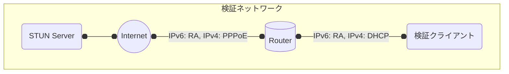
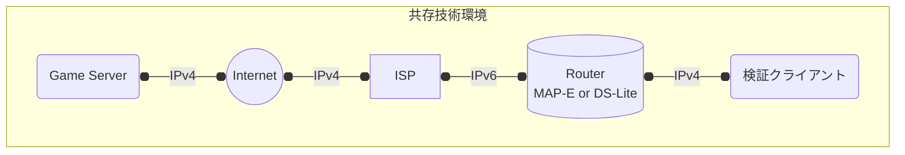

# IPv6対応UPnP 対応ルータ情報

ゲーム・エンタメのネットワーク接続性に関する課題検討WG IPv6対応UPnP実装・検証SWG

Copyright (c) 2025 JAIPA

## 変更履歴

- rev.20250418a（2025年4月18日）
	- 初版

## 目次

1. 本ドキュメントについて
2. 対応基準・検証内容
3. 対応ルータリスト

## 1. 本ドキュメントについて

本ドキュメントは、国内におけるIPv6対応UPnPの活用促進を目的として作成・更新されています。

2023年に国内で初めてIPv6対応UPnPが動作するルータが登場したものの、本機能に対応したルータをゲームユーザが探しだすことは現状困難であり、また、ルータベンダー側も多機能化した現代における家庭用ルータにおいて、対応状況をゲームユーザにわかりやすく伝えるのは容易ではありません。

この課題を解決するため、JAIPAの運営する「JAIPA ゲーム・エンタメNW接続性課題検討WG IPv6対応UPnP実装・検証SWG（以下SWGと略）」において、IPv6対応UPnPの動作検証と情報集約を行い、ゲームユーザ向けには対応ルータを簡単に探せる場を、ルータベンダー側には情報を掲載する場をそれぞれ提供します。

## 2. 対応基準・検証項目

### 2.1 対応基準

Open Connectivity Foundation（以下OCFと略） の定めるUPnP技術仕様の内、「[WANIPv6FirewallControl:1 Service](https://upnp.org/specs/gw/UPnP-gw-WANIPv6FirewallControl-v1-Service.pdf)」の仕様を前提として、

- A. IPv6 MulticastによるDiscovery
- B. AddPinhole Action による Firewall 制御

を行うものとする。

その上で、IPv6 Firewall（SPI）を備えた家庭用ルータのLAN側に接続されたクライアントから、IPv6でUDP通信を行った場合のNAPT挙動が、RFC 4787 に記載の「Endpoint-Independent Mapping / Endpoint-Independent Filtering」へ改善されることを基準とする。

現在市場に流通している家庭用ルータの傾向から「機能としては不十分だが、ゲームユーザの混乱を招きやすいもの」として「A. IPv6 MulticastによるDiscovery」のみに対応するものが多数確認されているため、参考情報として当該ルータの情報も掲載する。

#### 2.1.1 OCFの仕様に含まれない追加の用語定義

##### <u>IPv6対応UPnP</u>

WANIPv6FirewallControl:1 Service に対応し、IPv6 MulticastによるDiscovery 及び AddPinhole Action による Firewall 制御 を行えるUPnP実装を、IPv6対応UPnPと定義する

##### <u>Pinhole機能</u>

WANIPv6FirewallControl:1 Service に対応し、AddPinhole ActionによるFirewall制御を行うことが出来るルータ側の機能をPinhole機能と定義する

#### 2.1.2 対応状況を示す記号について

「3. 対応ルータリスト」一覧で表記される記号と対応する基準は以下の通りとし、A,B,C のいずれかを満たす機種をリストに掲載する。

- A: 初期状態でPinhole機能が利用可能
- B: 管理画面等からルータの設定を変更することでPinhole機能が利用可能
- C: Discoveryには反応するが、Pinhole機能は利用不可
- D: Discoveryにそもそも反応しない

> 一般的なゲームユーザ向けには「A」の基準を満たすことが望ましい。一定の知識を有するゲームユーザ向けであれば「B」でも実用上問題ない。

### 2.2 検証環境

下図のようなIPv4/IPv6デュアルスタック環境で検証を実施する。

### 2.3 対応結果の齟齬・掲載対象としているルータについて

検証結果は本SWGが独自に検証した結果であり、各ベンダーの公開する情報や、指定環境/ファームウェアバージョン以外で動作させた場合の挙動とは一致しない可能性がある。

また、SWGメンバーが実態を調査したルータのうち、該当するものを順次掲載しているため、市場に流通している機種を網羅できていない可能性がある。

### 2.4 各ルータベンダーへ

掲載されている検証結果についての問い合わせや、未掲載機種の検証希望につきましては下記までお問い合わせください。

- 問い合わせ先：

  - TO: IPv6対応UPnP実装・検証SWG ML (gamingnw-wg@jaipa.or.jp)

  - CC: JAIPA事務局 (info@jaipa.or.jp)

なお、本SWGはオープンなコミュニティとして運営しており、興味がありましたら本検証活動に参加いただけます。

### 2.5 参考文献

IPv6対応UPnPの意義・実装に関しては、下記資料も参照。

- [【CEDEC講演資料】ゲームにおけるIPv6向けUPnPの活用可能性と実装検証](https://cedil.cesa.or.jp/cedil_sessions/view/2619)
- [【JANOG講演資料】ついにIPv6向けUPnPが実運用フェーズに！〜 ゲームのP2Pオンライン対戦での活用フィードバックを添えて 〜](https://www.janog.gr.jp/meeting/janog53/upnp/)
- [【Web記事】AtermがIPv6による新世代UPnPに対応！ KONAMIとの共同検証で実現したピンホール制御で、ゲームもIoTもIPv6直接接続へ](https://internet.watch.impress.co.jp/docs/column/shimizu/1538789.html)

### 2.6 補足：IPv6マイグレーション技術（IPv4 over IPv6）に関して

下記のような、MAP-E・DS-Lite 等を用いたIPv4 over IPv6環境におけるIPv4通信をIPv6通信と混同する人が多いが、これらはクライアント-ルータ間で見た場合には、IPv4通信である。

このような場合に用いられるのは、Pinhole機能（IPv6対応UPnP）ではなく、従来のIPv4向けのUPnPであるため、注意すること。

> なお、IPv4 over IPv6環境下において、従来のIPv4対応UPnP機能が機能するか否かにうちては、実際のネットワーク環境とルータの実装による

## 3. IPv6対応UPnP 検証済ルータリスト

> 掲載順はローマ字表記のA-Za-zとします。

### 3.1 NECプラットフォームズ株式会社

| 機種   | ファームウェア | 検証日     | 検証結果 | 製品情報 | 備考 |
| -------- | -------------- | ---------- | -------- | ---- | ---- |
| Aterm WX5400HP | Ver2.0.1  | 2025.03.28 | A       | [Webサイト](https://www.aterm.jp/product/atermstation/product/warpstar/wx5400hp/) |      |
| Aterm WX5400T6 | Ver1.2.4  | 2025.03.28 | A       | [Webサイト](https://www.aterm.jp/product/atermstation/product/warpstar/wx5400t6/) |      |
| Aterm 7200D8BE | Ver1.1.1 | 2025.04.09 | A | [Webサイト](https://www.aterm.jp/product/atermstation/product/warpstar/7200d8be/) | |
